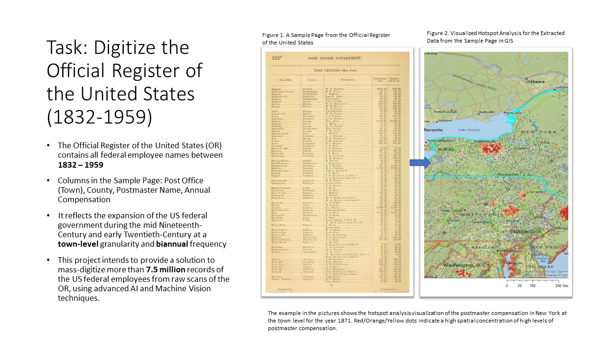
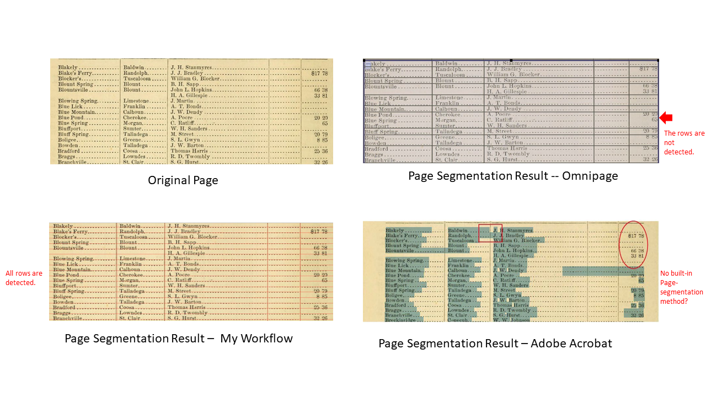
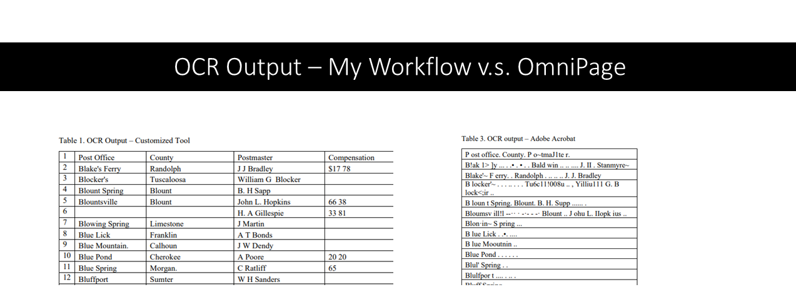
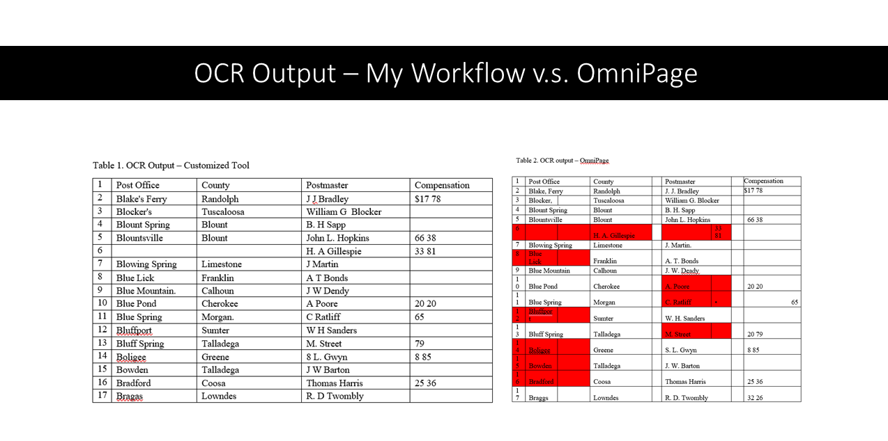
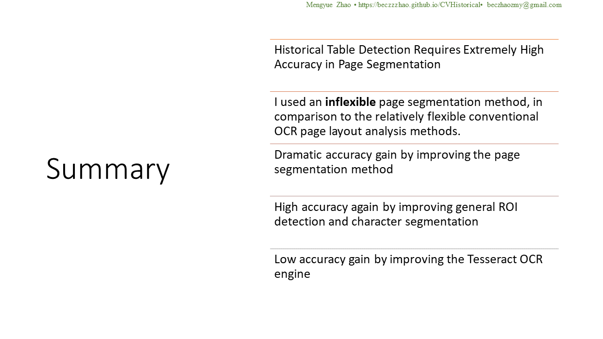

## Welcome

My name is Rebecca (Mengyue Zhao). I am a data scientist who now works in the private sector. I completed a degree of MSc in Economic and Social History at the University of Oxford in 2018, and have been working on this project since 2016. Please feel free to get in touch if you want to learn more about my projects. 
- email: beczhaozmy@gmail.com
- [Get in touch through LinkedIn](https://www.linkedin.com/in/mengyue-rebecca-zhao-a15bb8111/)
- Read [my paper](https://www.linkedin.com/posts/mengyue-rebecca-zhao-a15bb8111_machine-vision-tools-enhancement-for-ocr-activity-6893647253307736064-dONL?utm_source=linkedin_share&utm_medium=member_desktop_web) on this OCR project
- Read my paper on the town-level, nation-wide postal revenue for Nineteenth-Century America: [The Economic Geography of Nineteenth-Century America --Mapping from National-Scale, Town-Level Postal Revenue](https://github.com/becZzZhao/CVHistorical/blob/decb15239f242eb1f2b5e652fa10f86b2a2c83c4/20220607%20The%20Economic%20Geography%20of%2019th%20Century%20America%20-%20Edit%201%20-%20Mengyue%20Zhao.pdf)

## the Machine Vision Project in Action
I built a stable and efficient workflow to handle the poor layouts of historical tables using machine vision techniques. OCR tasks for tabular data requires extremely high accuracy from the page layout analysis due to the need to align column and rows. Commercial software packages do not handle these tasks well, because they are not trained to detect old (Nineteenth-Century) table format. The page layout information is then feed into a deep learning OCR engine. The result is a dramatic increase in OCR accuracy.

<iframe width="560" height="315" src="https://www.youtube.com/embed/Jh_KobCtuIQ" title="YouTube video player" frameborder="0" allow="accelerometer; autoplay; clipboard-write; encrypted-media; gyroscope; picture-in-picture" allowfullscreen></iframe>

## Visualzed Data - The Economic Geography of Nineteenth-Century America  
#### Example of New York
 

## Introduction 

## Solution Architecture

## Performance Comparison
### Page Segmentation Results Comparison

\n

### OCR Results Comparison

## Final Output

## Concluding Remarks

